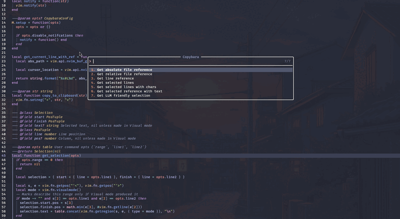

# copybara.nvim

A tiny Neovim plugin for copying file references to your clipboard. Yes, I've missed it after JetBrains.

Open a menu, pick what you want, and it's copied. That's it.



## What it can copy

- Absolute path: `/home/you/project/lua/copybara/init.lua`
- Relative path: `lua/copybara/init.lua`
- Current line: `/home/you/project/lua/copybara/init.lua#L50`
- Selected lines: `/home/you/project/lua/copybara/init.lua#L10-L20`
- Selected lines with columns: `/home/you/project/lua/copybara/init.lua#L10C5-L20C12`
- Selection reference plus the selected text
- LLM friendly selection: relative path with line range, then the selected text. Handy for pasting into a chat with an AI.

The selection options only show up when you run the command from Visual mode.

## Install

With [lazy.nvim](https://github.com/folke/lazy.nvim):

```lua
{
  "7KiLL/copybara.nvim",
  opts = {},
}
```

Or with any other manager, then call setup:

```lua
require("copybara").setup()
```

## Usage

Run `:Copybara` in Normal mode or after selecting text in Visual mode to open the menu.

Every action also has a name you can pass directly, so you can skip the menu. Tab completes them.

| Argument     | Copies                                              | Needs         |
| ------------ | --------------------------------------------------- | ------------- |
| `file_rel`   | `lua/copybara/init.lua`                             |               |
| `file_abs`   | `/home/you/project/lua/copybara/init.lua`           |               |
| `line_rel`   | `lua/copybara/init.lua#L50`                         |               |
| `line_abs`   | `/home/you/project/lua/copybara/init.lua#L50`       |               |
| `range_rel`  | `lua/copybara/init.lua#L10-L20`                     | a range       |
| `range_abs`  | `/home/you/project/lua/copybara/init.lua#L10-L20`   | a range       |
| `chars`      | `/home/you/project/lua/copybara/init.lua#L10C5-L20C12` | Visual mode |
| `chars_text` | the `chars` reference, then the selected text       | Visual mode   |
| `llm`        | `range_rel`, then the selected text                 | Visual mode   |

Suggested keymaps:

```lua
vim.keymap.set({ "n", "v" }, "<leader>Cc", ":Copybara<CR>", { desc = "Copybara menu" })
vim.keymap.set("n", "<leader>Cf", ":Copybara file_rel<CR>", { desc = "Copy relative path" })
vim.keymap.set("n", "<leader>Cl", ":Copybara line_rel<CR>", { desc = "Copy line reference" })
vim.keymap.set("v", "<leader>Cl", ":Copybara range_rel<CR>", { desc = "Copy selected lines" })
vim.keymap.set("v", "<leader>Ca", ":Copybara llm<CR>", { desc = "Copy selection for an LLM" })
```

## Options

```lua
require("copybara").setup({
  disable_notifications = false, -- set to true to stop the "Copied!" popup
})
```

## Requirements

- Neovim 0.10 or newer
- A clipboard provider (the plugin writes to the `+` register)
